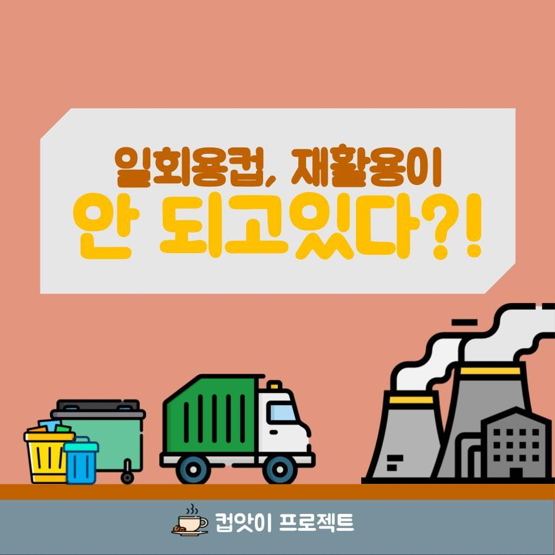
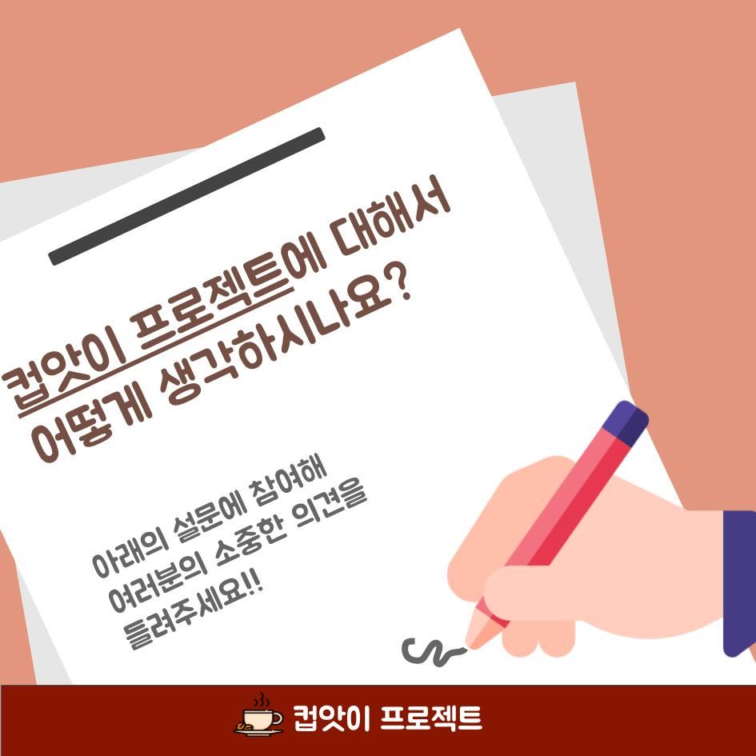

# 컵앗이 - 공유컵 프로젝트

[TOC]

## 카드뉴스

## 소개

안녕하세요! 저희는 경희대학교 시민교육에서 **공유컵 프로젝트**를

진행하고 있습니다.

본 프로젝트는 `일회용 컵 자체의 사용량을 줄이자`에 중점을 두고 있습니다.

일회용컵 보증금제, 텀블러 사용 권장 켐페인 등과 같은 방향에서

경희대 생활권 내에서 _공유경제_를 컨셉으로 따릉이와 전기 킥보드 같이,

> `테이크 아웃 컵 또한,공유하면 어떨까?`

라는 생각으로 본 프로젝트를 시행하게 되었습니다.

## 실제 프로젝트는 아니에요.

`참여의사를 여쭈어보지만, 반드시 참여한다는 듯은 아닙니다.`

이 프로젝트는 이런 아이디어가 있으면 카페 입장에서

1. 어느 점이 참여에 도움을 주었는지

2. 그렇지 않다면, 개선해야 할 점은 무엇인지

를 알아보기 위함입니다.

## 컵앗이는 어떻게 이루어지나요?

큰 개요는 아래와 같습니다:)

1. 공유 컵 프로젝트 참여 카페를 선정합니다.

2. 카페마다 구청에서 지원하는 공유 컵을 비치합니다.

3. 손님은 테이크아웃시 일회용 컵과 공유 컵 중 선택합니다.

4. 공유컵은 참여 카페 중 어디에서나 반납가능 합니다.

5. 수거된 컵은 세척 후 재사용 합니다.

## 카페에게 어떤 도움이 되나요?

커피 1회당 제공하는 일회용 컵 1개의 가격은 플라스틱 투명 컵 (약 98.4원) 과

뚜껑(약 23.2원), 빨대(약 4.4원), 홀더(약 23.8원)을 합치면 약 149.8원 입니다.

이 150원은 소비자에게 할인을, 카페에게 지출 비용 감소를 유도합니다.

두번째로, 환경 오염을 줄이기 위한 활동 참여로 이미지 상승이나 홍보 효과 등을

기대할 수 있습니다.

## 어떤 문제가 있을까요?

1. 초기비용 문제

공유 컵은 구청에서 지원받아 _카페에서 부담하는 비용_은 없을 것으로 생각됩니다.

2. 공유 컵 세척 문제

위생은 가장 중요한 문제입니다.

초기 단계에서 세척이 용이하지 않은 음료를 제외하거나, 컵의 개수를 제한하고,

세척 도구 제공을 지원합니다. 또한 이런 실험 단계에서 일어나는 문제점들을 

관리자 측에서 적극 수렴해 해결 할 예정입니다.

3. 공유 컵 수거율 문제

공유 컵이 반납되지 않을 수 있습니다.

만약 훼손이나 유실되어도 카페에서 부담하지 않습니다. 

또한 컵앗이 프로젝트 로고를 컵에 부착하여 이를 방지할 수 있도록 하겠습니다.

## 감사합니다!

아래의 링크로 가시면 구글 설문에 참여하실 수 있습니다.

https://forms.gle/ZEASnToSCh6CgFPS8
